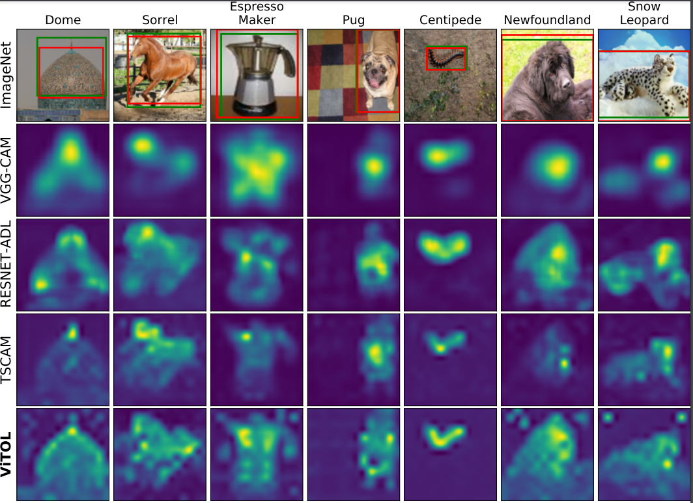

# ViTOL: Vision Transformers for Weakly Supervised Object Localization 

Official implementation of the paper [***ViTOL: Vision Transformer forWeakly Supervised Object Localization***]([https://arxiv.org/abs/2204.06772](https://openaccess.thecvf.com/content/CVPR2022W/L3D-IVU/papers/Gupta_ViTOL_Vision_Transformer_for_Weakly_Supervised_Object_Localization_CVPRW_2022_paper.pdf)) which is accepted as [***CVPRW-2022***](https://cvpr2022.thecvf.com/) paper for [***L3DIVU-2022***](https://sites.google.com/view/l3d-ivu/overview?authuser=0). 

This repository contains inference code and pre-trained model weights for our model in Pytorch framework. Code is trained and tested in *Python 3.6.9* and *Pytorch version 1.7.1+cu101*

### ViTOL-GAR Localization maps:




### Model Zoo 
We provide pre-trained weights for VITOL with DeiT-S and DeiT-B backbone on ImageNet-1k and CUB datasets below. 

###### ImageNet: [***ViTOL-base***](https://drive.google.com/file/d/1YYg2VV3p4kQxviFKPwgcH2Hm3OyuUUR5/view?usp=sharing), [***ViTOL-small***](https://drive.google.com/file/d/1TtnjsLSgoU_E5XDdDoLjxKG0orbGx4B2/view?usp=sharing)
###### CUB: Updating soon 

### Results on ImageNet-1k dataset 
|      **Method**     | **MaxBoxAccV2** | **Top1Acc** | **IOU50** | **Top1Cls** |
|:-------------------:|:---------------:|:-----------:|:---------:|:-----------:|
| **ViTOL-GAR Small** |    69.61    |  54.74  | 71.86 |  71.84  |
| **ViTOL-LRP Small** |    68.23    |  53.62  | 70.48 |  71.84  |
|  **ViTOL-GAR Base** |    69.17    |  57.62  | 71.32 |  77.08  |
|  **ViTOL-LRP Base** |    70.47    |  58.64  | 72.51 |  77.08  |

### Results on CUB dataset 
###### updating soon 

### Usage 
Clone the repository 
``` git clone https://github.com/Saurav-31/ViTOL.git ```

Setup conda environment 
 
``` markdown
conda env create -f environment.yml
conda activate vitol
```

## Dataset preparation 
Please refer [here](https://github.com/clovaai/wsolevaluation) for dataset preparation 

## Inference results on ImageNet 

##### Edit the config files under configs folder
###### 1. Add paths to ImageNet dataset 
``` python
--data_root=\PATH\TO\DATASET
--metadata_root=\PATH\TO\GROUND_TRUTH 
```
###### 2. Download ViTOL weights and copy to directory named "pretrained_weights"
```--CHECKPOINT_NAME=$VITOL_WEIGHTS_TAR_FILENAME```
### RUN ViTOL Base with GAR 
```bash evaluate.sh configs/ilsvrc/ViTOL_GAR_base.yml```
### RUN ViTOL Small with GAR
```bash evaluate.sh configs/ilsvrc/ViTOL_GAR_small.yml```

##### To do 
- Setup Training Code for the same 
- Train the model with more stronger backbones 
- Jupyter notebook for visualization 

##### We borrow code from
<sub>[***Evaluating Weakly Supervised Object Localization Methods Right (CVPR 2020)***](https://github.com/clovaai/wsolevaluation)</sub>
<sub>[***Transformer Interpretability Beyond Attention Visualization (CVPR 2021)***](https://github.com/hila-chefer/Transformer-Explainability)</sub>

### Contacts
If you have any question about our work or this repository, please don't hesitate to contact us by emails.
 - saurav.gupta@mercedes-benz.com
 - sourav.lakhotia@mercedes-benz.com
 - abhay.rawat@mercedes-benz.com
 - rahul.tallamraju@mercedes-benz.com

### Citation 
If you find this work useful, please cite as follows:
```
@inproceedings{gupta2022vitol,
  title={ViTOL: Vision Transformer for Weakly Supervised Object Localization},
  author={Gupta, Saurav and Lakhotia, Sourav and Rawat, Abhay and Tallamraju, Rahul},
  booktitle={Proceedings of the IEEE/CVF Conference on Computer Vision and Pattern Recognition},
  pages={4101--4110},
  year={2022}
}
```


